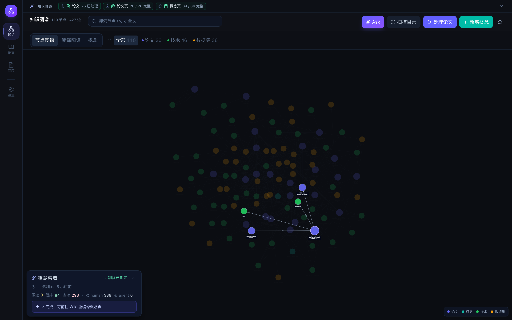
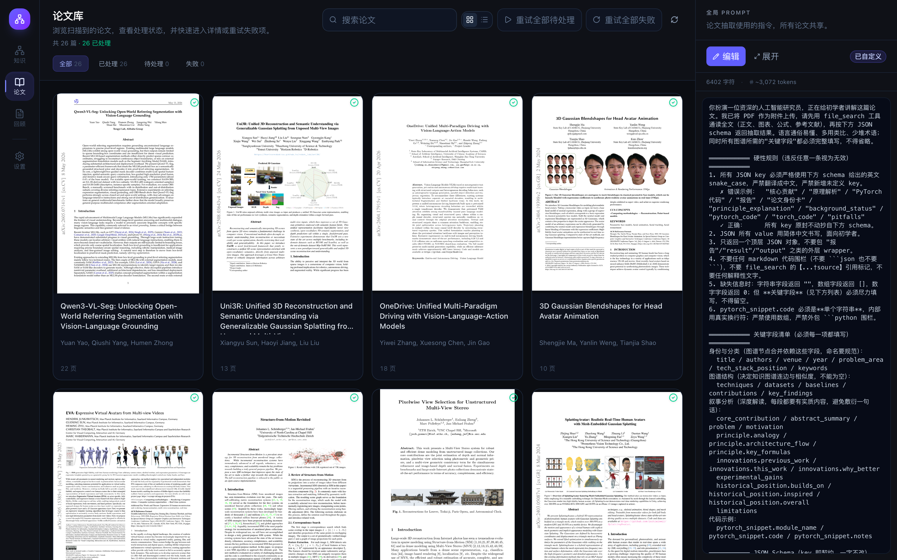
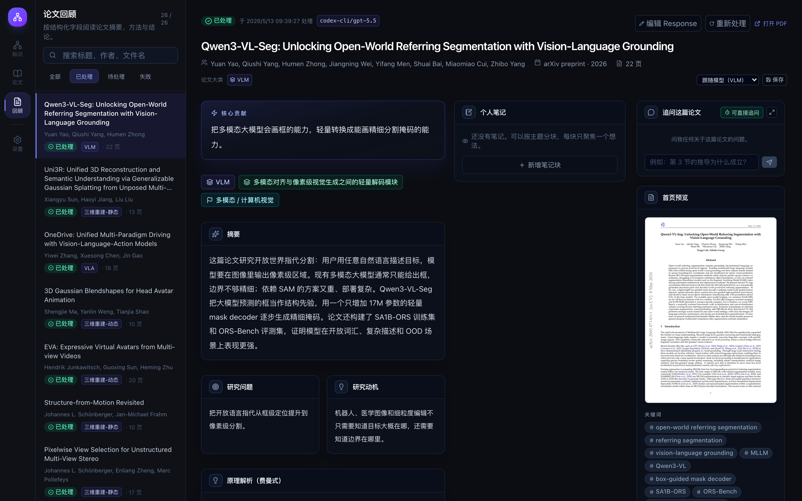

# Knowledge Wiki

[中文](README.zh.md) | [English](README.md)

Knowledge Wiki, named Knowledge Tree in the app, is a local-first research tool for building a personal paper knowledge base. It scans PDF papers, extracts structured review data with an OpenAI model, and turns papers, methods, datasets, findings, and notes into an interactive knowledge graph.

For installation, runtime dependencies, and startup commands, see [Install](INSTALL.md).

## What The App Does

- **Paper library**: scan a local folder of PDFs, keep page counts and first-page previews, and track processing state for each paper.
- **Paper review**: inspect model-extracted metadata, summaries, research questions, methods, datasets, baselines, contributions, and findings.
- **Repair workflow**: edit raw model responses when formatting is slightly wrong, reprocess a single paper with confirmation, and tune the extraction prompt.
- **Personal notes**: write Markdown notes per paper, paste or drop screenshots into notes, and zoom images in a lightbox.
- **Knowledge graph**: browse generated nodes for papers, techniques, datasets, research areas, findings, and similarity links.
- **Similarity rebuilds**: recompute embedding-based `similar` edges with a configurable threshold without re-running paper extraction.
- **Local storage**: keep the database, PDFs, thumbnails, note images, and configuration under the local `data/` directory.

## Screenshots

### Knowledge Graph



### Paper Library



### Paper Review



## Typical Workflow

1. Put PDF papers in `data/papers/`, or choose another scan directory in Settings.
2. Open the Graph page and scan the paper directory.
3. Process papers in batch, or reprocess a specific paper from the review view.
4. Review the extracted response, fix small formatting issues if needed, and save the repaired response.
5. Add personal Markdown notes and screenshots while reading.
6. Use the graph to explore connections between papers, techniques, datasets, findings, and research areas.
7. Adjust the prompt or similarity threshold as your research corpus evolves.

## Data Model

Knowledge Wiki stores runtime data in SQLite and the local filesystem.

### Core Tables

- `papers`: one row per PDF, including path, title, authors, venue, year, page count, processing status, model response, parsed extraction result, notes, and chat state.
- `nodes`: graph entities generated from processed papers. Main node types include `paper`, `technique`, `dataset`, `problem_area`, and `finding`.
- `edges`: typed graph relationships between nodes.
- `config`: local application settings, including model choices, scan directory, similarity threshold, and cached assistant ID.
- `prompt`: the editable extraction prompt used by future processing runs.

### Graph Relationships

The graph uses typed edges to make paper knowledge navigable:

- `uses`: a paper or method uses a technique.
- `belongs_to`: a paper or concept belongs to a research area.
- `builds_on`: a method builds on another method.
- `trained_on`: a model or paper trains on a dataset.
- `evaluated_on`: a paper evaluates on a dataset.
- `compared_to`: a paper compares against a baseline.
- `finding`: a paper supports a key finding.
- `similar`: two nodes are connected by embedding similarity.

### Local Files

```text
data/
├── config.json              # local settings and API key; ignored by Git
├── knowledge.db             # SQLite database; ignored by Git
├── papers/                  # default PDF scan directory; ignored by Git
└── artifacts/
    ├── first_pages/         # rendered first-page previews
    └── note_images/         # pasted or dropped note images
```

## Project Layout

```text
.
├── backend/                 # FastAPI API, database models, and paper services
│   ├── routers/             # papers / graph / config / prompt / note image routes
│   ├── services/            # PDF, scanning, LLM extraction, graph building, cleanup
│   ├── config.py            # runtime config and model defaults
│   ├── database.py          # SQLite initialization and lightweight migrations
│   └── requirements.txt
├── frontend/                # React + Vite frontend
│   ├── src/api/             # API client and types
│   ├── src/components/      # graph, detail, and processing status components
│   └── src/pages/           # graph, papers, review, prompt, and settings pages
├── data/                    # local runtime data; repo keeps only placeholders
├── docs/                    # architecture, API, and development docs
├── INSTALL.md               # install and quick start guide
└── start.sh                 # one-command launcher
```

## Operations

- **Rebuild similarity edges**: run Rebuild Similarity Edges in Settings. This does not call the extraction model again.
- **Reset graph**: run Reset Graph in Settings. This clears generated nodes and edges and marks papers as unprocessed.
- **Edit extraction prompt**: use the Prompt page; future processing runs use the updated prompt.
- **Repair a response**: use the Paper Review page to edit the model response, then save and reparse it.
- **Reprocess a paper**: use the per-paper reprocess action; the app asks for confirmation before starting.
- **Clear cached assistant**: set `openai_assistant_id` to an empty value through the config API; the next run creates a new assistant.

## Privacy

Knowledge Wiki is designed for local personal research workflows. By default, the repository ignores:

- `data/config.json`
- `data/knowledge.db`
- `data/papers/*`
- `data/artifacts/*`
- `backend/.venv`
- `frontend/node_modules`
- `frontend/dist`

Model processing sends paper content to the configured OpenAI API. Keep private or licensed papers out of shared repositories, and share only sanitized sample data when needed.

## Docs

- [Install](INSTALL.md)
- [Architecture](docs/ARCHITECTURE.md)
- [API](docs/API.md)
- [Development](docs/DEVELOPMENT.md)
