# Knowra

[中文](README.zh.md) | [English](README.md)

Knowra is a local-first research workspace for turning papers into a searchable personal knowledge system. It scans PDF papers, extracts structured review data, builds a living graph of papers / methods / datasets / concepts, compiles wiki pages, and lets you ask cross-paper questions on top of that compiled knowledge.

The current build is no longer tied to a single OpenAI path. It now ships with a task-routed model gateway, so different parts of the product can run on different providers and price tiers.

For installation, environment setup, and startup commands, see [Install](INSTALL.md).

## Highlights

- **Task-routed model gateway**: bind a different model to each task instead of using one global model everywhere. Settings now expose per-task routing for `paper_extract`, `paper_chat`, `embedding`, `wiki_compile`, `ask_agent`, `ask_synthesis`, and `promotion_judge`.
- **Multi-provider support**: built-in support for `OpenAI`, OpenAI-compatible APIs (`Kimi`, `DeepSeek`, `Qwen`, `MiniMax`), and local `Codex CLI`, with provider health checks in Settings.
- **Codex CLI across all non-embedding tasks**: paper extraction, paper follow-up chat, wiki compilation, Ask, Ask-to-concept synthesis, and concept promotion can now run through local Codex. Embeddings remain API-based.
- **Compiled knowledge loop**: extracted paper JSON becomes graph nodes and wiki pages; Ask reads the compiled wiki layer instead of raw PDFs, so Q&A is grounded in your curated knowledge base.
- **Ask as a real workspace**: multi-session Ask history is stored locally in the browser, new chats are supported, session titles are generated by the model, and answers or full sessions can be filed back as concept pages.
- **Exportable Ask answers**: any answer can be rendered into a Marp slide deck (`data/wiki/decks/`) or a structured report (`data/wiki/reports/`), alias-tagged and immediately re-searchable by Ask — explorations "add up".
- **Wiki health-check (content linter)**: a zero-cost rule pass surfaces thin pages, mergeable concept pairs, and missing connecting concepts (paper clusters with no spanning concept); one Agent call then judges them and proposes follow-up questions, producing `data/wiki/lint-report.md` you can apply item-by-item.
- **Obsidian-native**: every wiki `.md` carries `aliases` frontmatter, so `[[paper:N]]` / `[[concept:N]]` resolve and the backlink graph works when `data/wiki/` is opened as an Obsidian vault.
- **Concept synthesis with guardrails**: Ask-generated concepts support duplicate detection, force-create override, relation edge generation, immediate graph insertion, and wiki search index refresh.
- **Paper review with repair + follow-up**: each paper has structured extraction, editable raw response, note-taking, first-page preview, paper record markdown, and per-paper follow-up chat.
- **Living knowledge graph**: promoted concepts, similarity edges, search/focus, wiki-backed node details, and rebuildable embedding similarity without re-running extraction.

## Pages & Screenshots

The app is organized as five pages reachable from the left nav (`知识 / 论文 / 回顾 / 看板 / 设置`). Each page is a self-contained workspace; the cross-cutting state (LLM call telemetry, wiki compile progress, processing status) flows through the same backend.

### 知识 · Knowledge Graph

Main canvas. Builds and explores the compiled knowledge layer (papers + concepts + edges) and hosts the operations that take a corpus from "raw PDFs in a folder" to "curated, queryable wiki".

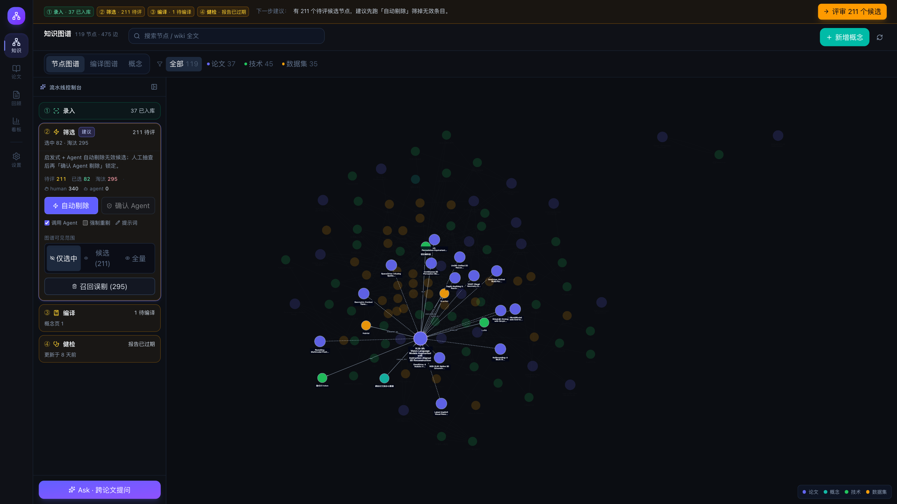

- **Pipeline Console (left rail)** — A guided 4-stage workflow (`① 录入 / ② 筛选 / ③ 编译 / ④ 健检`). Each stage has its own status badge (idle / running / warning / ok), the recommended next step glows, and clicking expands per-stage actions (scan + process, run promotion, recompile, run lint, etc.).

  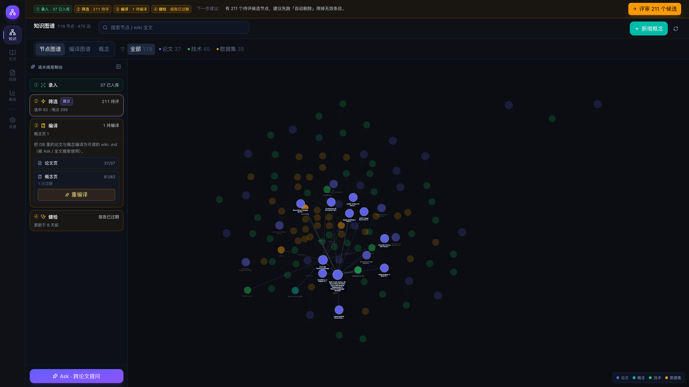

- **Ask drawer** — Cross-wiki Q&A agent. The agent calls `list_wiki_index / search_wiki / read_wiki` tools against the compiled `.md` layer, returns a markdown answer with citations, exposes the tool trace, and lets you file a strong answer back as a concept page or export as a Marp deck / report.

  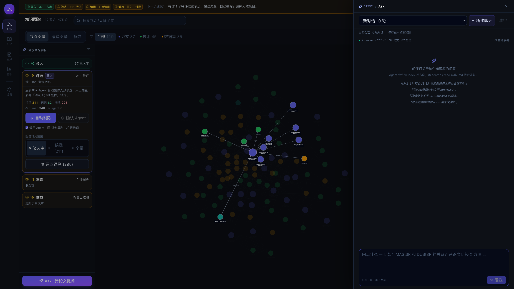

- **Wiki health-check** — Rule layer + single agent call that surfaces thin pages (`待充实`), mergeable pairs (`可合并`), and missing connecting concepts (`待建概念`), plus 5 follow-up questions. Each item has an inline action (recompile / mark-accepted / merge / question → Ask).

  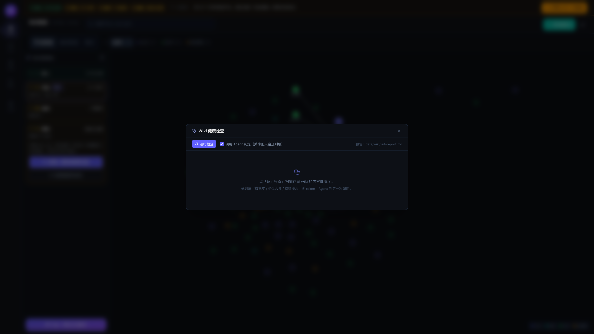

### 论文 · Papers

Paper library. Scans the configured PDF directory, displays per-paper processing state, lets you batch-process or reprocess, and surfaces failure summaries.

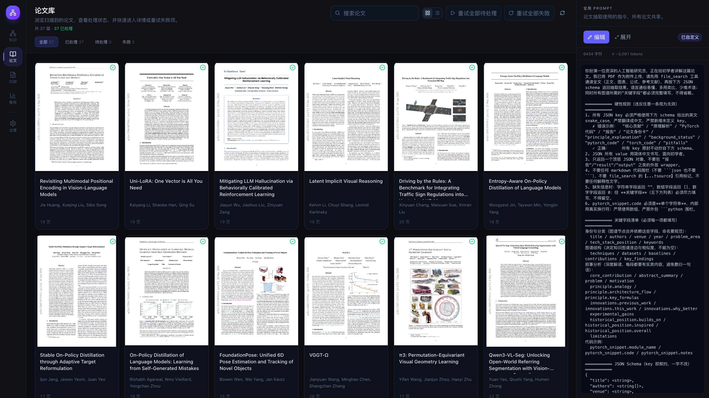

### 回顾 · Review

Per-paper deep-read workspace. Shows the structured extraction (problem / motivation / techniques / datasets / contributions / key findings / formulas) in cards, plus a personal-notes side column, an `Ask this paper` follow-up chat, and the first-page preview.

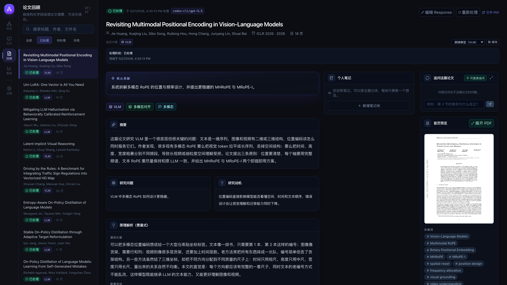

- **In-app PDF side panel** — Click `展开 PDF` on the first-page thumbnail to open a right-anchored PDF reader. The paper-list column auto-collapses, the structured extraction stays visible on the left, and the PDF covers `个人笔记 + 首页预览` without occluding `核心贡献`. Zoom (`+ / − / 0`), wheel zoom (`Ctrl/⌘ + scroll`), and **position-preserving zoom**: the viewport stays anchored at the same paragraph across scale changes. Closing (Esc / X / click-outside) persists the per-paper scroll + scale so the next open resumes at the same place.

  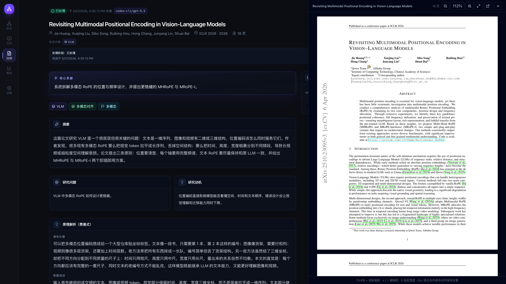

### 看板 · Dashboard

Read-only data board for the whole knowledge base. Single backend aggregation endpoint feeds all widgets so every chart reflects one consistent snapshot.

- **Top-6 knowledge directions** as a radar (papers / concepts / edge density per high-frequency tag, all normalized).
- **Growth timelines** over the last 12 weeks (papers / concepts / edges), derived from existing timestamps.
- **Distribution pies** with chip legends for `paper_category` and `node_type`, plus a tag-cloud Top-20.
- **Curation health** (`status × promoted_by` stacked bar) and the oldest-pending age.
- **Network structure** — top-10 hub concepts by degree, orphan count, average degree, relation-type mix.
- **Compile & lint state** + **30-day LLM usage** (calls / tokens / latency by task and by model).

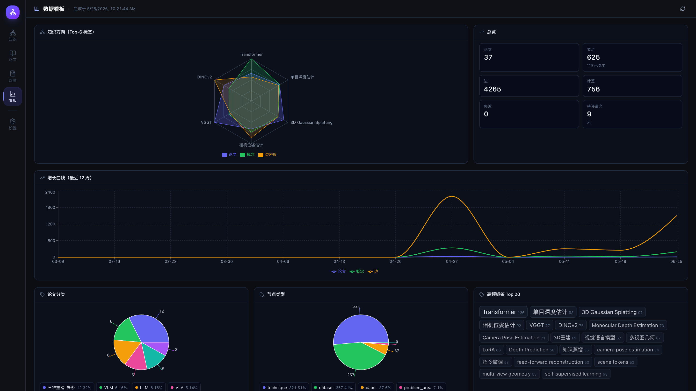

### 设置 · Settings

Task-routed model gateway. Bind a model per logical task (`paper_extract / paper_chat / embedding / wiki_compile / ask_agent / ask_synthesis / promotion_judge / wiki_lint`), select among configured providers (OpenAI / OpenAI-compatible / local Codex CLI), run a provider health check, and tune the similarity threshold + maintenance actions.

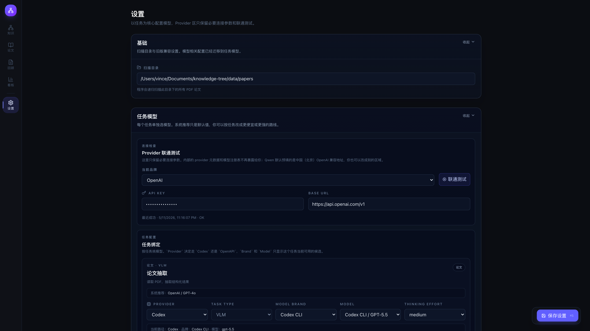

## End-to-End Flow

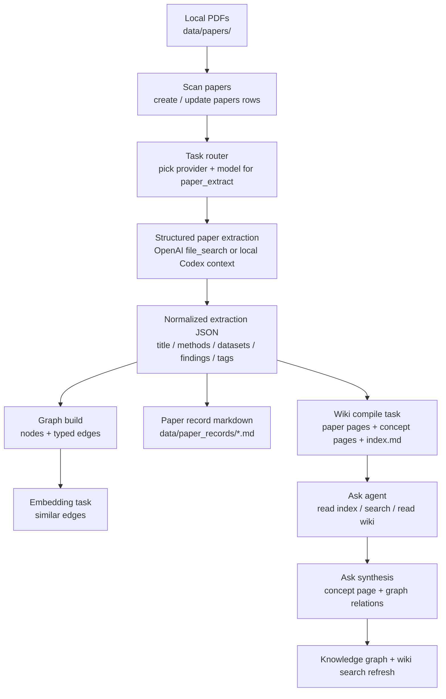

## Task Model Routing

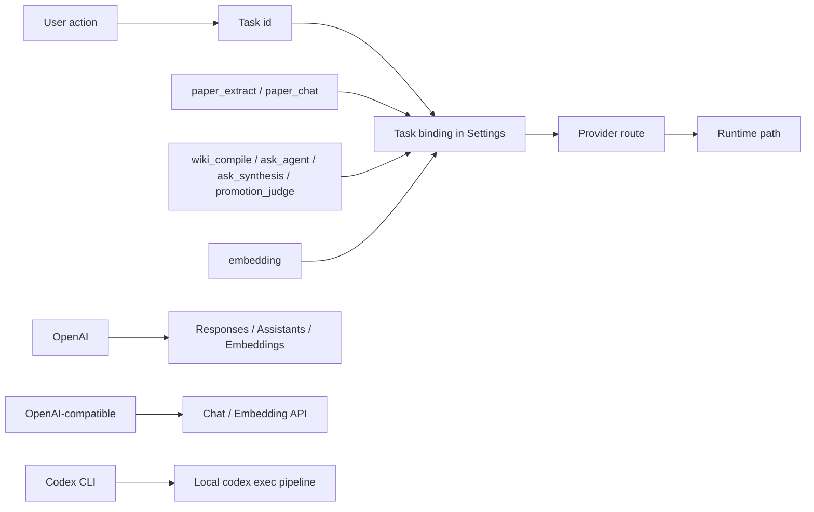

### Built-in task split

| Task | Purpose | Typical routes |
| --- | --- | --- |
| `paper_extract` | Read a PDF and produce structured extraction JSON | OpenAI VLM, Codex CLI |
| `paper_chat` | Ask follow-up questions within one paper | OpenAI VLM, Codex CLI |
| `embedding` | Vectorize nodes and build `similar` edges | OpenAI embeddings |
| `wiki_compile` | Rewrite extracted knowledge into paper/concept wiki pages | OpenAI, OpenAI-compatible, Codex CLI |
| `ask_agent` | Cross-wiki Q&A with retrieval steps | OpenAI, OpenAI-compatible, Codex CLI |
| `ask_synthesis` | Turn Ask answers into concept pages | OpenAI, OpenAI-compatible, Codex CLI |
| `promotion_judge` | Promote/reject candidate concepts | OpenAI, OpenAI-compatible, Codex CLI |
| `wiki_lint` | Agent judgment + follow-up generation for the wiki health-check | OpenAI, OpenAI-compatible, Codex CLI |

For a code-level map of every model call, see [docs/llm-call-map.md](docs/llm-call-map.md).

## Wiki Health-Check & Outputs

After Ask, the knowledge base "thickens itself" along three lines: retrieval Q&A, answer file-back, and content health-checks. The **wiki health-check** is the linting step from Karpathy's LLM knowledge-base blueprint.

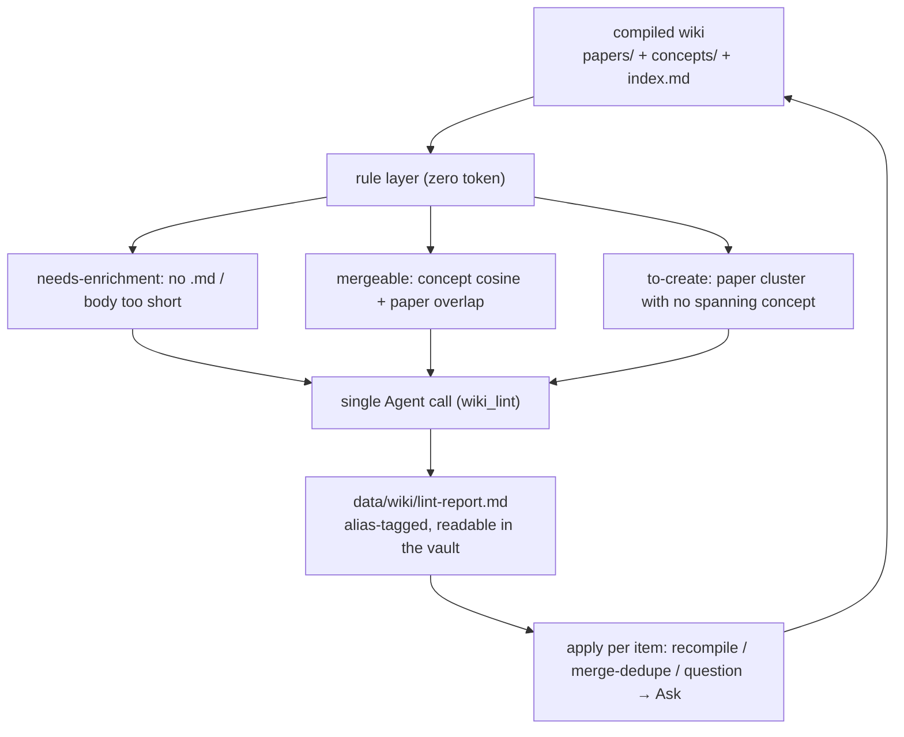

- **Rule layer**: pure Python, no tokens. "Needs enrichment" only fires when a page has no `.md` or a genuinely short body (single-paper count is context, never a trigger). Merge pairs use concept embedding cosine + source-paper Jaccard. "To-create" finds paper clusters that recur together but are not tied by any concept.
- **Agent judgment**: rule-prefiltered material is packed into one call (offline batch, generous timeout) returning enrich/merge/drop verdicts, merge confirmations, new-concept proposals, and 5 follow-up questions.
- **Output & loop**: writes `data/wiki/lint-report.md` (Obsidian-readable, links jump); the UI applies items inline and results flow back into the wiki.

> Note: for a thin "single-source, already compiled, unchanged" concept, recompiling is essentially a no-op due to the content-signature cache — those are better merged or accepted; the health-check wording reflects that.

## Typical Workflow

1. Configure task models in **Settings** and run a provider health check.
2. Put PDF papers in `data/papers/`, or point the scan directory somewhere else.
3. Scan the directory and process papers.
4. Review each extraction, fix malformed raw responses if needed, and add personal notes.
5. Let the system build graph nodes, similarity edges, wiki paper pages, concept pages, and `index.md`.
6. Use **Ask** to query across papers and concepts.
7. Save strong Ask answers back as concept pages, or export them as Marp decks / reports filed into the wiki.
8. Run the **Wiki health-check** periodically and act on the report (enrich / merge / to-create).
9. Rebuild similarity edges or wiki index as the corpus grows; open `data/wiki/` in Obsidian to browse the backlink graph.

## Local Data

```text
data/
├── config.json              # local settings and API keys; ignored by Git
├── knowledge.db             # SQLite database; ignored by Git
├── papers/                  # default PDF scan directory; ignored by Git
├── artifacts/
│   ├── first_pages/         # rendered paper previews
│   └── note_images/         # pasted or dropped note images
├── paper_records/           # per-paper working markdown records
└── wiki/
    ├── papers/             # compiled paper wiki pages
    ├── concepts/           # compiled / manual concept pages
    ├── decks/              # Marp slide decks exported from Ask answers
    ├── reports/            # structured reports exported from Ask answers
    ├── index.md            # top-level wiki index for Ask
    └── lint-report.md      # wiki health-check report
```

> `data/.obsidian/` is an optional Obsidian vault config; open `data/wiki/` as a vault and `aliases` resolves `[[paper:N]]` / `[[concept:N]]` backlinks.

## Project Layout

```text
.
├── backend/                 # FastAPI routes, services, DB models, migrations
│   ├── routers/             # papers / graph / ask / config / wiki / promotion
│   ├── services/            # PDF extraction, graph build, Ask, wiki compile
│   ├── config.py            # runtime config and legacy compatibility
│   └── requirements.txt
├── frontend/                # React + Vite app
│   ├── src/api/             # API client and shared types
│   ├── src/components/      # Ask drawer, graph, node detail, review widgets
│   └── src/pages/           # graph, papers, review, settings
├── model_gateway/           # provider registry, task specs, runtime adapters
├── data/                    # local runtime data
├── docs/                    # architecture and implementation docs
├── INSTALL.md               # install and quick start
├── README.md
└── README.zh.md
```

## Key Operations

- **Rebuild similarity edges**: recompute embedding-based `similar` edges using the current threshold, without re-running extraction.
- **Rebuild wiki index**: regenerate `data/wiki/index.md` so Ask sees the latest paper and concept pages.
- **Reset graph**: clear generated nodes and edges and mark papers as unprocessed; manual concepts remain.
- **Repair a paper response**: edit malformed extraction output directly from the Review page, then reparse it.
- **Reprocess one paper**: rerun extraction only for that paper.
- **Switch model routes**: assign cheaper or stronger models per task from Settings.

## Privacy

Knowra is designed for local personal research workflows. By default, the repository ignores:

- `data/config.json`
- `data/knowledge.db`
- `data/papers/*`
- `data/artifacts/*`
- `data/paper_records/*`
- `data/wiki/*`
- `backend/.venv`
- `frontend/node_modules`
- `frontend/dist`

Model-backed processing still sends content to the provider bound to that task. For example, OpenAI routes use API calls, while Codex CLI routes execute through the local `codex` command. Keep private or licensed papers out of shared repositories, and share only sanitized samples when needed.

## Docs

- [Install](INSTALL.md)
- [Architecture](docs/ARCHITECTURE.md)
- [LLM Call Map](docs/llm-call-map.md)
- [API](docs/API.md)
- [Development](docs/DEVELOPMENT.md)
