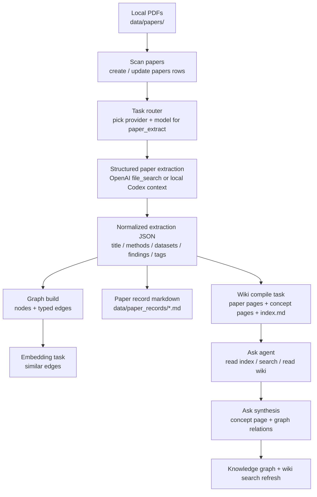
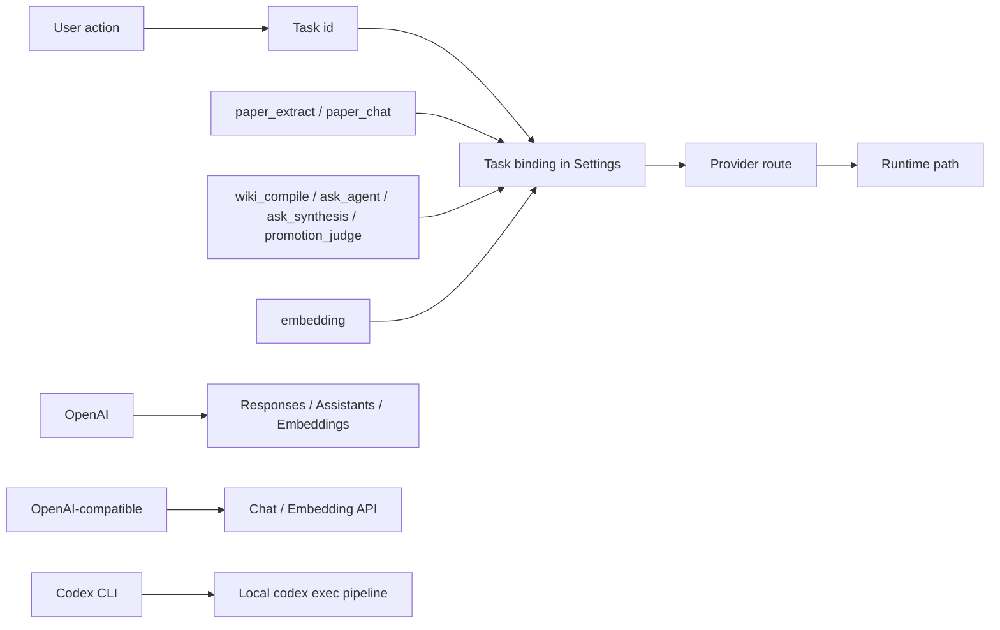

# Knowra

[中文](README.zh.md) | [English](README.md)

Knowra is a local-first research workspace for turning papers into a searchable personal knowledge system. It scans PDF papers, extracts structured review data, builds a living graph of papers / methods / datasets / concepts, compiles wiki pages, and lets you ask cross-paper questions on top of that compiled knowledge.

The current build is no longer tied to a single OpenAI path. It now ships with a task-routed model gateway, so different parts of the product can run on different providers and price tiers.

For installation, environment setup, and startup commands, see [Install](INSTALL.md).

## Highlights

- **Task-routed model gateway**: bind a different model to each task instead of using one global model everywhere. Settings now expose per-task routing for `paper_extract`, `paper_chat`, `embedding`, `wiki_compile`, `ask_agent`, `ask_synthesis`, and `promotion_judge`.
- **Multi-provider support**: built-in support for `OpenAI`, OpenAI-compatible APIs (`Kimi`, `DeepSeek`, `Qwen`, `MiniMax`), and local `Codex CLI`, with provider health checks in Settings.
- **Codex CLI across all non-embedding tasks**: paper extraction, paper follow-up chat, wiki compilation, Ask, Ask-to-concept synthesis, and concept promotion can now run through local Codex. Embeddings remain API-based.
- **Compiled knowledge loop**: extracted paper JSON becomes graph nodes and wiki pages; Ask reads the compiled wiki layer instead of raw PDFs, so Q&A is grounded in your curated knowledge base.
- **Ask as a real workspace**: multi-session Ask history is stored locally in the browser, new chats are supported, session titles are generated by the model, and answers or full sessions can be filed back as concept pages.
- **Concept synthesis with guardrails**: Ask-generated concepts support duplicate detection, force-create override, relation edge generation, immediate graph insertion, and wiki search index refresh.
- **Paper review with repair + follow-up**: each paper has structured extraction, editable raw response, note-taking, first-page preview, paper record markdown, and per-paper follow-up chat.
- **Living knowledge graph**: promoted concepts, similarity edges, search/focus, wiki-backed node details, and rebuildable embedding similarity without re-running extraction.

## End-to-End Flow



## Task Model Routing



### Built-in task split

| Task | Purpose | Typical routes |
| --- | --- | --- |
| `paper_extract` | Read a PDF and produce structured extraction JSON | OpenAI VLM, Codex CLI |
| `paper_chat` | Ask follow-up questions within one paper | OpenAI VLM, Codex CLI |
| `embedding` | Vectorize nodes and build `similar` edges | OpenAI embeddings |
| `wiki_compile` | Rewrite extracted knowledge into paper/concept wiki pages | OpenAI, OpenAI-compatible, Codex CLI |
| `ask_agent` | Cross-wiki Q&A with retrieval steps | OpenAI, OpenAI-compatible, Codex CLI |
| `ask_synthesis` | Turn Ask answers into concept pages | OpenAI, OpenAI-compatible, Codex CLI |
| `promotion_judge` | Promote/reject candidate concepts | OpenAI, OpenAI-compatible, Codex CLI |

For a code-level map of every model call, see [docs/llm-call-map.md](docs/llm-call-map.md).

## Pages At A Glance

- **Knowledge Graph**: the main canvas for graph exploration, Ask, wiki search, concept curation, and graph-level actions.
- **Papers**: the paper library for scanning directories, checking processing state, and batch operations.
- **Review**: per-paper workspace with structured extraction, raw response repair, notes, first-page preview, and paper follow-up chat.
- **Ask drawer**: cross-wiki research assistant with saved sessions, trace inspection, and “file back as concept page”.
- **Settings**: task-centric model routing, provider health checks, similarity threshold, and maintenance actions.

## Screenshots

### Knowledge Graph


### Paper Library


### Paper Review


## Typical Workflow

1. Configure task models in **Settings** and run a provider health check.
2. Put PDF papers in `data/papers/`, or point the scan directory somewhere else.
3. Scan the directory and process papers.
4. Review each extraction, fix malformed raw responses if needed, and add personal notes.
5. Let the system build graph nodes, similarity edges, wiki paper pages, concept pages, and `index.md`.
6. Use **Ask** to query across papers and concepts.
7. Save strong Ask answers back as concept pages, with duplicate checks and graph relation generation.
8. Rebuild similarity edges or wiki index as the corpus evolves.

## Local Data

```text
data/
├── config.json              # local settings and API keys; ignored by Git
├── knowledge.db             # SQLite database; ignored by Git
├── papers/                  # default PDF scan directory; ignored by Git
├── artifacts/
│   ├── first_pages/         # rendered paper previews
│   └── note_images/         # pasted or dropped note images
├── paper_records/           # per-paper working markdown records
└── wiki/
    ├── papers/             # compiled paper wiki pages
    ├── concepts/           # compiled / manual concept pages
    └── index.md            # top-level wiki index for Ask
```

## Project Layout

```text
.
├── backend/                 # FastAPI routes, services, DB models, migrations
│   ├── routers/             # papers / graph / ask / config / wiki / promotion
│   ├── services/            # PDF extraction, graph build, Ask, wiki compile
│   ├── config.py            # runtime config and legacy compatibility
│   └── requirements.txt
├── frontend/                # React + Vite app
│   ├── src/api/             # API client and shared types
│   ├── src/components/      # Ask drawer, graph, node detail, review widgets
│   └── src/pages/           # graph, papers, review, settings
├── model_gateway/           # provider registry, task specs, runtime adapters
├── data/                    # local runtime data
├── docs/                    # architecture and implementation docs
├── INSTALL.md               # install and quick start
├── README.md
└── README.zh.md
```

## Key Operations

- **Rebuild similarity edges**: recompute embedding-based `similar` edges using the current threshold, without re-running extraction.
- **Rebuild wiki index**: regenerate `data/wiki/index.md` so Ask sees the latest paper and concept pages.
- **Reset graph**: clear generated nodes and edges and mark papers as unprocessed; manual concepts remain.
- **Repair a paper response**: edit malformed extraction output directly from the Review page, then reparse it.
- **Reprocess one paper**: rerun extraction only for that paper.
- **Switch model routes**: assign cheaper or stronger models per task from Settings.

## Privacy

Knowra is designed for local personal research workflows. By default, the repository ignores:

- `data/config.json`
- `data/knowledge.db`
- `data/papers/*`
- `data/artifacts/*`
- `data/paper_records/*`
- `data/wiki/*`
- `backend/.venv`
- `frontend/node_modules`
- `frontend/dist`

Model-backed processing still sends content to the provider bound to that task. For example, OpenAI routes use API calls, while Codex CLI routes execute through the local `codex` command. Keep private or licensed papers out of shared repositories, and share only sanitized samples when needed.

## Docs

- [Install](INSTALL.md)
- [Architecture](docs/ARCHITECTURE.md)
- [LLM Call Map](docs/llm-call-map.md)
- [API](docs/API.md)
- [Development](docs/DEVELOPMENT.md)
