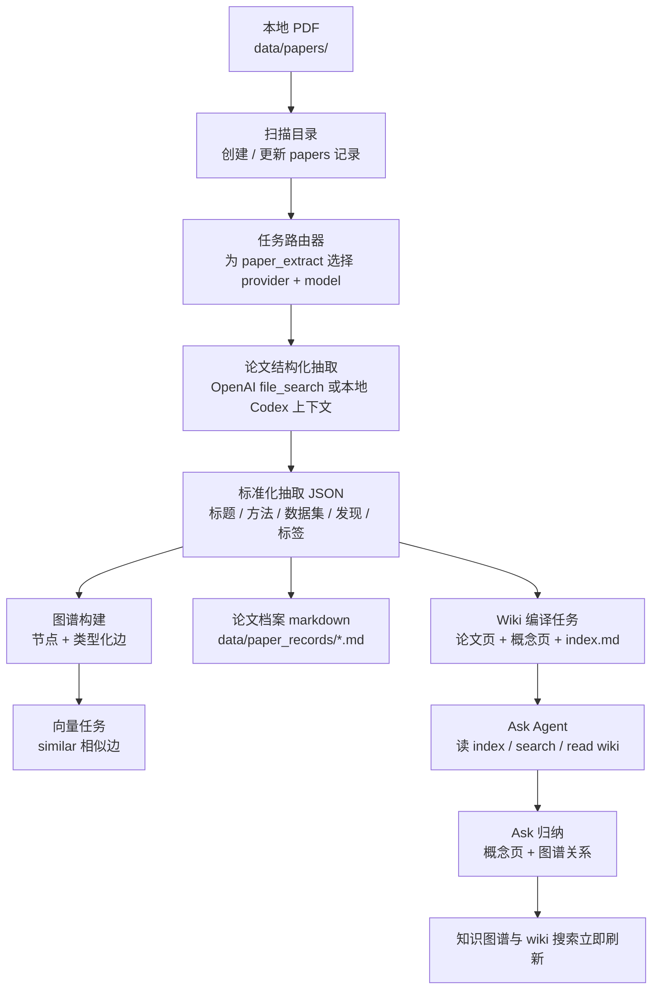
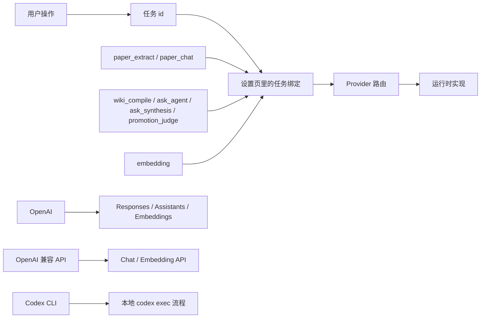
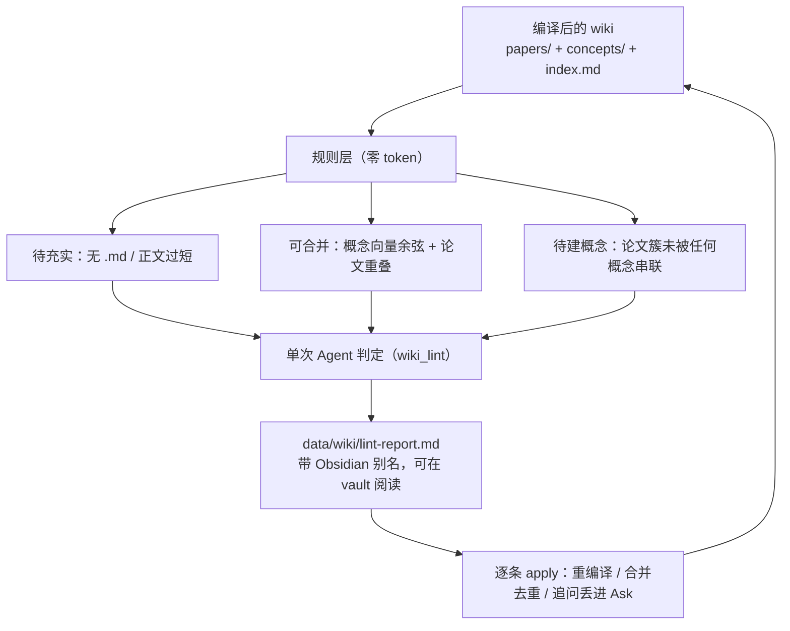

# Knowra

[中文](README.zh.md) | [English](README.md)

Knowra 是一个本地优先的研究工作台，目标是把论文逐步沉淀成一个可搜索、可追问、可演化的个人知识系统。它会扫描 PDF，抽取结构化论文信息，生成知识图谱，编译 wiki 页面，并在编译后的知识层之上支持 Ask 问答与概念沉淀。

当前版本已经不再依赖单一的 OpenAI 链路，而是引入了按任务路由的模型网关：不同功能模块可以绑定不同 provider、不同价格带的模型。

安装、依赖环境和启动命令请看 [安装说明](INSTALL.zh.md)。

## 亮点功能

- **按任务绑定模型**：不再用一个全局模型覆盖所有能力；现在可以分别给 `paper_extract`、`paper_chat`、`embedding`、`wiki_compile`、`ask_agent`、`ask_synthesis`、`promotion_judge` 绑定不同模型。
- **多 Provider 支持**：内置 `OpenAI`、OpenAI 兼容 API（`Kimi`、`DeepSeek`、`Qwen`、`MiniMax`）以及本机 `Codex CLI`，并支持在设置页做联通测试。
- **Codex CLI 覆盖全部非 embedding 子模块**：论文抽取、论文追问、Wiki 编译、Ask、Ask 生成概念、概念精选判断都可以走本机 Codex；只有向量任务仍然保留 API 路线。
- **编译知识闭环**：论文抽取结果会进入图谱和 wiki；Ask 读取的是编译后的 wiki 层，而不是直接读原始 PDF，因此问答更接近“在你的知识库上推理”。
- **Ask 变成真正的工作区**：支持多会话、本地持久化、新建聊天、模型生成会话标题、查看 trace，并且可以把单轮答案或整段会话整理成概念页。
- **Ask 答案可导出回填**：单条回答可一键整理成 Marp 幻灯（`data/wiki/decks/`）或结构化报告（`data/wiki/reports/`），带 Obsidian 别名、写完即可被 Ask 二次检索 —— 探索结果"越用越厚"。
- **概念沉淀带防重和关系生成**：Ask 生成概念时支持重复检测、强制新建覆盖误判、自动补图谱关系边，并立即刷新图谱与 wiki 搜索索引。
- **Wiki 健康检查（内容 linter）**：规则层零成本扫出待充实条目、可合并概念对、待建概念（论文簇未被串联），再一次 Agent 调用做判定并生成追问建议，产出 `data/wiki/lint-report.md`，可在界面里逐条 apply。
- **Obsidian 原生可用**：所有 wiki `.md` 带 `aliases` frontmatter，`[[paper:N]]` / `[[concept:N]]` 在 Obsidian vault 里可解析跳转，反链图谱直接生效。
- **论文回顾可修可问**：每篇论文都有结构化抽取、可编辑的原始 response、Markdown 笔记、首页预览图、论文档案 markdown，以及单篇论文上下文追问。
- **活的知识图谱**：支持概念精选、相似边重建、节点搜索聚焦、wiki 驱动的详情阅读，以及无需重新抽取论文的图谱迭代。

## 端到端流程图



## 任务模型路由



### 内置任务拆分

| 任务 | 作用 | 常见路由 |
| --- | --- | --- |
| `paper_extract` | 读取 PDF，生成结构化论文抽取 JSON | OpenAI VLM、Codex CLI |
| `paper_chat` | 在单篇论文上下文中追问 | OpenAI VLM、Codex CLI |
| `embedding` | 给节点生成向量并建立 `similar` 边 | OpenAI embeddings |
| `wiki_compile` | 把抽取结果改写成论文页 / 概念页 / index.md | OpenAI、OpenAI 兼容 API、Codex CLI |
| `ask_agent` | 跨 wiki 的检索式问答 | OpenAI、OpenAI 兼容 API、Codex CLI |
| `ask_synthesis` | 把 Ask 回答整理成概念页 | OpenAI、OpenAI 兼容 API、Codex CLI |
| `promotion_judge` | 对候选概念做 promote / reject 判断 | OpenAI、OpenAI 兼容 API、Codex CLI |
| `wiki_lint` | Wiki 健康检查的 Agent 判定与追问生成 | OpenAI、OpenAI 兼容 API、Codex CLI |

如果你想看代码层面每一个模型调用点，可以直接看 [docs/llm-call-map.md](docs/llm-call-map.md)。

## 知识库健康检查与产出

Ask 之后，知识库会沿三条线"自我增厚"：检索式问答、答案回填、内容体检。其中 **Wiki 健康检查** 对应 Karpathy 提出的 LLM 知识库蓝图里的 linting 环节。



- **规则层**：纯 Python，不花 token —— 待充实只在"没编译出 .md"或"正文确实过短"时触发（单篇引用只作上下文注解，不误报）；可合并用概念 embedding 余弦 + 源论文 Jaccard；待建概念找反复共现却没有概念串联的论文簇。
- **Agent 判定**：把规则预筛结果打包成一次调用（离线批处理，超时上限放宽），输出 enrich/merge/drop 裁决、合并确认、新概念提议，以及结合现状的 5 条追问。
- **产出与回填**：写 `data/wiki/lint-report.md`（Obsidian 可读、链接可跳）；界面里可对每条直接行动，处理结果再回流到 wiki，形成闭环。

> 注：对"单篇来源 + 已编译 + 未变动"的薄概念，重编译受内容签名缓存约束基本是空操作 —— 这类更适合"合并"或"接受现状"，健康检查的文案与建议据此区分。

## 页面介绍

- **知识图谱**：主工作台，负责图谱探索、Ask、Wiki 健康检查、wiki 搜索、概念精选和图谱级操作。
- **论文页**：论文库，负责扫描目录、查看处理状态和批量处理。
- **论文回顾**：单篇论文工作区，负责查看结构化抽取、修 response、记笔记、看首页预览、做单篇论文追问。
- **Ask 抽屉**：跨论文 / 跨概念问答入口，支持多会话保存、trace 查看、存为概念页。
- **设置页**：任务模型绑定、provider 联通测试、相似度阈值、维护操作。

## 界面预览

### 知识图谱


### 论文库


### 论文回顾


## 典型使用流程

1. 在 **设置** 页为不同任务绑定模型，并先做一次 provider 联通测试。
2. 把 PDF 放进 `data/papers/`，或把扫描目录改到别的位置。
3. 扫描目录并处理论文。
4. 在论文回顾里检查抽取结果，必要时修复格式不稳的原始 response，并补充个人笔记。
5. 让系统自动生成图谱节点、相似边、论文 wiki 页、概念页和 `index.md`。
6. 用 **Ask** 在整库范围内提问。
7. 把高价值 Ask 结果沉淀成概念页，或导出成 Marp 幻灯 / 报告回填 wiki。
8. 定期跑 **Wiki 健康检查**，按报告处理待充实 / 可合并 / 待建概念。
9. 随着语料增长，重建相似边或重建 wiki 索引；用 Obsidian 打开 `data/wiki/` 浏览反链图。

## 本地数据

```text
data/
├── config.json              # 本地设置和 API Key，默认不提交
├── knowledge.db             # SQLite 数据库，默认不提交
├── papers/                  # 默认 PDF 扫描目录，默认不提交
├── artifacts/
│   ├── first_pages/         # 论文首页预览缓存
│   └── note_images/         # 粘贴或拖入笔记的图片
├── paper_records/           # 每篇论文的工作档案 markdown
└── wiki/
    ├── papers/             # 编译后的论文 wiki 页
    ├── concepts/           # 编译或手工创建的概念页
    ├── decks/              # Ask 答案导出的 Marp 幻灯
    ├── reports/            # Ask 答案导出的结构化报告
    ├── index.md            # Ask 使用的顶层知识索引
    └── lint-report.md      # Wiki 健康检查报告
```

> `data/.obsidian/` 是可选的 Obsidian vault 配置；把 `data/wiki/` 作为 vault 打开即可借助 `aliases` 解析 `[[paper:N]]` / `[[concept:N]]` 反链。

## 项目结构

```text
.
├── backend/                 # FastAPI 路由、服务、DB 模型、迁移
│   ├── routers/             # papers / graph / ask / config / wiki / promotion
│   ├── services/            # PDF 抽取、图谱构建、Ask、Wiki 编译
│   ├── config.py            # 运行配置与旧字段兼容
│   └── requirements.txt
├── frontend/                # React + Vite 前端
│   ├── src/api/             # API client 与共享类型
│   ├── src/components/      # Ask 抽屉、图谱、节点详情、回顾组件
│   └── src/pages/           # graph / papers / review / settings
├── model_gateway/           # provider 注册表、任务定义、运行时适配器
├── data/                    # 本地运行数据
├── docs/                    # 架构与实现文档
├── INSTALL.zh.md            # 中文安装与快速开始
├── README.md
└── README.zh.md
```

## 常用操作

- **重建相似度边**：按当前阈值重新计算 embedding 相似边，不需要重新抽取论文。
- **重建 wiki 索引**：重新生成 `data/wiki/index.md`，让 Ask 看到最新论文页和概念页。
- **重置图谱**：清空自动生成的节点和边，并把论文重新标成待处理；手工概念会保留。
- **修复单篇论文 response**：直接在论文回顾页改原始抽取结果并重新解析。
- **重处理单篇论文**：只对该论文重新跑抽取。
- **切换模型路线**：在设置页按任务切到更便宜或更强的模型。

## 隐私说明

Knowra 面向本地个人研究工作流。默认不会提交以下运行数据：

- `data/config.json`
- `data/knowledge.db`
- `data/papers/*`
- `data/artifacts/*`
- `data/paper_records/*`
- `data/wiki/*`
- `backend/.venv`
- `frontend/node_modules`
- `frontend/dist`

但模型调用仍然会把内容发送给当前任务绑定的 provider。比如 OpenAI 路线会走 API，而 Codex CLI 路线会通过本机 `codex` 命令执行。对于私有或受版权限制的论文，建议仅在本地使用，并在共享仓库时只保留脱敏样例。

## 文档

- [安装说明](INSTALL.zh.md)
- [架构说明](docs/ARCHITECTURE.md)
- [LLM 调用地图](docs/llm-call-map.md)
- [API 说明](docs/API.md)
- [开发说明](docs/DEVELOPMENT.md)
