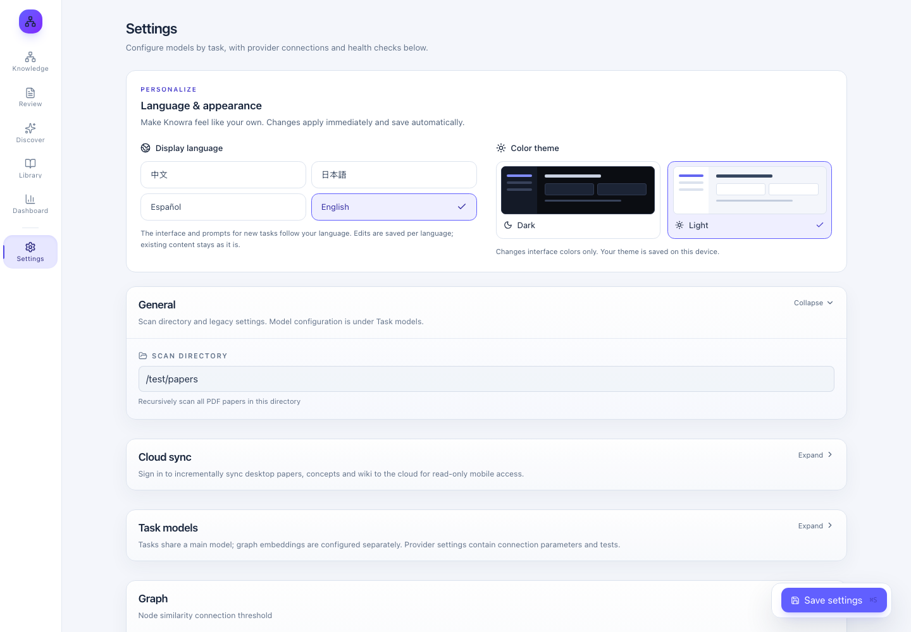
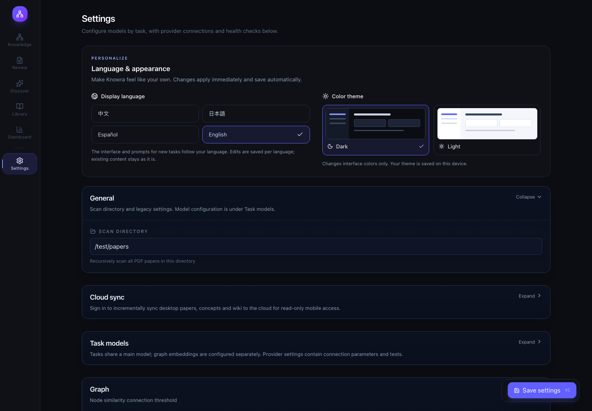

# Language and appearance

Settings → Language & appearance offers 中文, 日本語, Español and English, plus Dark and Light. The controls save automatically; the existing Save settings button still applies only to model, directory and graph configuration.





## Storage and scope

- UI catalogs are bundled in `frontend/src/i18n/locales/`. Chinese source messages serve as the default catalog. Only application messages are translated: paper names/content, user notes, custom categories, IDs and stored results are preserved.
- `knowra.locale` and `knowra.theme` in browser storage provide startup preferences. Theme is device-local and works offline; it is never sent to the backend. The HTML boot script applies the saved theme before the application loads.
- Language changes also select prompts for future local tasks. The selected language and overrides live in `data/presentation_preferences.json`, separate from provider credentials and algorithm settings. If saving fails, the previous language remains selected and the UI offers an error message.
- Extraction and curation prompts are independently editable in all four languages. GET/save/reset APIs accept a validated `locale=zh|ja|es|en`. Saving or resetting one bank never edits another bank. Empty curation prompts retain the existing “skip agent” behavior; empty extraction prompts fall back to that language's default.
- Existing Chinese custom prompts are read from legacy configuration until explicitly overridden. Saving model settings always uses the unlocalized legacy configuration, so it cannot copy a translated prompt into the Chinese bank.
- Full extraction/curation templates live in `backend/prompt_locales/`; Chinese defaults remain in `backend/prompts.py`. The extraction JSON schema is identical in all four versions. Small local response-language directives cover Ask, paper chat, wiki generation and newly generated abstract summaries while preserving tool names, schema keys, enum values, citation targets and task criteria.
- Existing generated content and cached summaries are not retranslated, invalidated or reprocessed on language/theme changes. No search, scoring, thresholds, graph layout, retrieval sequence, model routing or processing stages change. Recommendation scoring criteria remain unchanged; only the natural-language `reason` instruction follows the selected language.

## Theme implementation

Dark remains the default. Light uses cool off-white page backgrounds, white panels, slate text and indigo actions. Shared CSS tokens cover form controls, reading/Markdown/formula styles, chart tooltips and overlays. Cytoscape's canvas gets explicit color values through a stylesheet update that preserves the current graph instance, data and layout.

## Validation

```bash
npm --prefix frontend run build
npm --prefix frontend run test:e2e
backend/.venv/bin/python -m pytest -q backend/tests
```

Browser tests use mocked API fixtures, not the user's database or live model calls. They verify all four languages, persistence after reload, isolated prompt saves/resets, failure behavior, catalog and interpolation coverage, graph instance preservation, and the Spanish Light layout at 900 px width. Screenshots above use fixture settings.

Backend regression: **314 passed, 8 skipped**. The skipped tests depend on external infrastructure. Extraction schemas, language isolation and compatibility are tested without paid model calls. Live model quality/translation evaluation has not been run.

Frontend lint has 18 existing errors and 3 warnings, compared with 19 errors and 3 warnings on the base revision (one existing editor effect warning was removed). Python `ruff` and `mypy` are not installed in the available virtual environment. This change does not add or alter ML validation data or evaluation splits.

Restart the local backend after updating so `/api/prompt/preferences` and the locale-aware prompt routes become available. The currently running older backend may return 404 until restarted.
