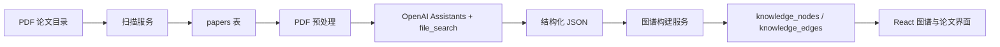
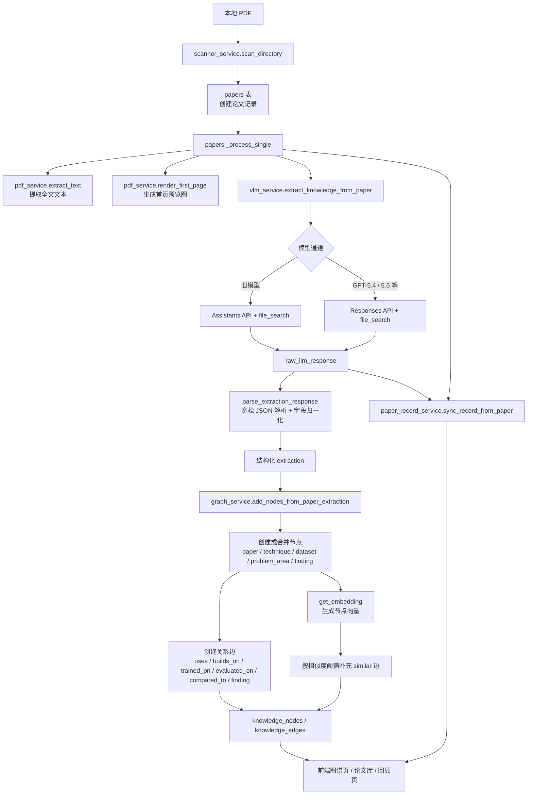

# 架构说明

Knowra 由一个本地 FastAPI 服务和一个 Vite/React 前端组成。后端负责扫描论文、调用 OpenAI、持久化知识图谱，并为每篇论文维护一份 markdown 档案；前端负责配置、触发处理、展示图谱和回顾抽取结果。

## 总体流程

## PDF 到知识图谱链路

下面这条链路描述的是一篇论文从本地 PDF 进入 Knowra，再变成图谱节点和边的实际处理过程。

### 关键说明

- `scanner_service.py` 只负责发现论文、去重并创建 `Paper` 记录，不直接构建图谱。
- 真正的主处理入口是 `backend/routers/papers.py` 里的 `_process_single()`。
- PDF 文本提取和首页渲染属于本地预处理，主要用于调试、展示和辅助信息，不是当前图谱生成的主输入。
- 论文理解的核心依赖 `vlm_service.py` 的 `file_search` 抽取；模型返回的 `raw_llm_response` 会先经过宽松解析和字段归一化，再交给图谱构建层。
- `graph_service.py` 会同时做两类工作：一类是按抽取字段显式创建语义边，另一类是按 embedding 相似度补 `similar` 边。
- 每篇论文还会同步生成一份 markdown 档案，保存源资料、首次响应、当前响应、笔记和追问记录，作为持续积累的原始知识语料。

## 后端模块

### API 层

- `backend/main.py` 创建 FastAPI 应用，挂载 CORS 和四组路由。
- `backend/routers/papers.py` 管理论文扫描、列表、详情、单篇/批量处理、重试、markdown 档案和处理状态。
- `backend/routers/graph.py` 提供图谱数据、节点详情、搜索、重建相似边和重置图谱。
- `backend/routers/config.py` 读取和更新运行配置，并对 API Key 做脱敏返回。
- `backend/routers/prompt.py` 读取、保存和重置论文抽取 Prompt。

### 服务层

- `scanner_service.py` 递归扫描 PDF，按文件路径和 MD5 去重。
- `pdf_service.py` 抽取 PDF 文本、渲染首页 PNG，并计算文件哈希。
- `vlm_service.py` 通过 OpenAI Assistants API 上传 PDF，使用 file_search 阅读全文，并要求模型返回 JSON。
- `graph_service.py` 将抽取 JSON 转换为节点和边，并用 embedding 相似度补充 `similar` 边。
- `paper_record_service.py` 为每篇论文生成/同步 markdown 档案，沉淀源信息、首次响应、当前响应、用户笔记和追问记录。

### 数据层

SQLite 数据库默认位于 `data/knowledge.db`。

主要表：

- `papers`：记录 PDF 文件、元信息、处理状态、OpenAI file id、原始模型响应和错误信息。
- `knowledge_nodes`：记录论文、技术、数据集、研究领域、关键发现等节点。
- `knowledge_edges`：记录节点关系，包含关系类型和权重。

除了 SQLite 外，每篇论文还会在 `data/paper_records/` 下生成一份 markdown 档案，作为持续积累论文知识语料的可读主档案。

`backend/database.py` 会在启动时执行 `create_all()`，并包含针对 SQLite 的轻量幂等迁移。

## 前端模块

- `frontend/src/App.tsx` 负责主导航和页面切换。
- `GraphPage.tsx` 展示图谱、搜索节点、按类型过滤、触发扫描和批量处理。
- `PapersPage.tsx` 展示论文库、处理状态、缩略图、错误和单篇重试。
- `ReviewPage.tsx` 查看单篇论文的抽取文本、原始模型响应和生成节点。
- `PromptEditorPage.tsx` 编辑和重置抽取 Prompt。
- `SettingsPage.tsx` 配置 API Key、扫描目录、模型、相似度阈值和维护操作。
- `KnowledgeGraph.tsx` 使用 Cytoscape 渲染交互式图谱。

## 关键设计

### 可编辑 Prompt

抽取 Prompt 保存在 `data/config.json`，用户可以在前端修改。Assistant 的系统指令保持稳定，真实抽取要求随每次用户消息发送，因此修改 Prompt 不需要重建 Assistant。

### 可复用 OpenAI 资源

处理论文时会缓存：

- 每篇论文的 `openai_file_id`，避免重复上传同一 PDF。
- 全局 `openai_assistant_id`，模型未变化时复用同一个 Assistant。

如果模型变化或 Assistant 不存在，服务会自动创建新的 Assistant。

### 图谱合并策略

技术、数据集和研究领域等节点会按规范化标题和别名进行合并，避免跨论文重复节点。关键发现默认按论文独立创建，因为它们通常是论文特定结论。

### 相似度边

节点创建时会调用 embedding 模型，若相似度超过配置阈值，会创建 `similar` 边。阈值调整后可以在设置页重建相似边，不需要重新抽取论文。
